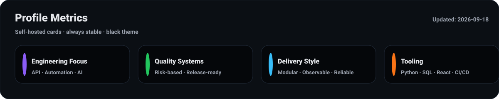
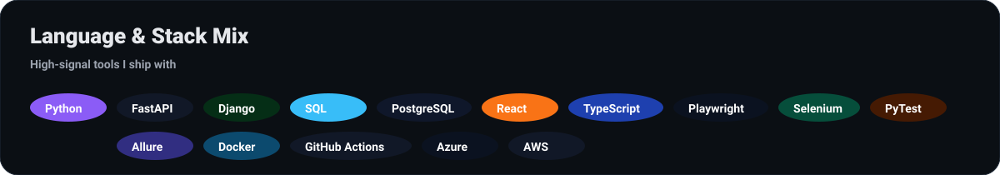

  <b>Senior Software Engineer</b> · <b>Full-Stack</b> · <b>QA/Automation</b> · <b>AI Workflows</b>

  I build <b>production-grade systems</b> end-to-end — scalable APIs, modern UI, automation frameworks, and release-ready quality.
  I operate with <b>systems thinking</b>: reliability, observability, traceability, and predictable delivery.

  
  
  
  

  
  
  
  

 

### 🌈 Snapshot
- 🧠 **8+ years** building Python-first systems across backend engineering, automation, and data workflows  
- ⚡ Strong in **scalable APIs**, **automation frameworks**, **DB validation**, **CI/CD**, and **engineering discipline**  
- 🧩 Built for **clarity + reliability**: traceability, observability, measurable quality, predictable delivery  

 

### 🧬 How I think & execute
- 🟣 **Quality engineered, not appended** → defect prevention mindset, not just detection  
- 🟦 **Traceability** → requirements → tests → results → release confidence  
- 🟢 **Stability-first automation** → resilient design, maintainable architecture, CI-friendly execution  
- 🟠 **Business-aligned testing** → risk-based coverage and regression strategy  
- 🟡 **Measurable outcomes** → dashboards, metrics, and decision-grade reporting  

 

### 🧱 Experience
- 🔥 **Senior Software Engineer / QA Automation Lead (2020–Present)** — building and stabilizing enterprise-grade platforms with a quality-first mindset  
  - 🧠 Scalable backend/API development (Python, Django/FastAPI), secure auth flows, clean modular architecture  
  - 🧪 End-to-end **test strategy & release readiness**: risk-based coverage, regression planning, QA sign-offs, defect prevention  
  - ⚙️ Automation at scale: **UI + API + DB validation**, CI-integrated execution, reporting (Allure), reliability improvements  
  - 🧾 Data-intensive workflows: reconciliation pipelines, anomaly/risk detection signals, integrity + traceability patterns  

- 🛰️ **Software Engineer / Test Engineer (2018–2020)** — foundation years focused on engineering + verification  
  - 🧩 Backend engineering support + E2E validation for business-critical workflows  
  - 🧪 Automation fundamentals: Selenium + PyTest, API verification, database-driven assertions, stable test design  
  - 🧰 Built reusable utilities, data generators, logging/monitoring patterns, repeatable QA processes  

- 💼 **Freelance / Independent Work (Ongoing)** — outcome-driven delivery across varied problem spaces  
  - 🧱 Python automation scripts, ETL/data transformations, scraping/structured extraction, dashboards & visual reporting  
  - 🔍 API validation workflows, productivity tooling, small-to-mid scale full-stack implementations  

 

### 🧪 What I’ve built (without fluff)
* 🏦 **Designed, developed, and deployed an end-to-end Bank Reconciliation (BRS) process** — ingestion → validation → reconciliation logic → exception handling → reporting  
* 🛡️ **Delivered SEBI-aligned fraud detection workflows** — signal extraction, rule/anomaly detection, case-ready evidence trails  
* 🧾 **Built reconciliation rule engines** — matching, partial matching, tolerance handling, multi-source alignment (ledger/bank/internal)  
* 🔎 **Implemented exception workflows** — auto-classification, prioritization, audit-friendly resolution paths, SLA-style tracking  
* 🧠 **Created risk & fraud indicators** — unusual frequency, amount deviation, reversals, circular patterns, identity mismatches, timing anomalies  
* 🧿 **Built automation execution monitoring** — visibility into runs, outcomes, failures, and reliability signals  
* 📊 **Developed analytics pipelines (Python + SQL)** — raw data → KPIs → decision-grade visual reporting  
* 🕸️ **Engineered web data extraction systems** — structured scraping, normalization, storage, comparison/analysis workflows  
* 🧵 **Implemented real-time monitoring & validation patterns** — integrity checks, event-driven verification, reliability guardrails  
* ⚙️ **Engineered automation + validation utilities** across UI/API/DB layers — accuracy, consistency, regression protection  
* 🔐 **Strengthened data integrity & security posture** — validation gates, controlled access patterns, audit-aware logging  
* 📦 **Standardized delivery pipelines** — CI-friendly execution, consistent reporting, repeatable deployment practices  

 

### 🧰 Tech Stack

 

### 🧪 Testing & Automation

 

### 🤖 AI in my engineering
- 🧠 **AI-assisted development** → faster prototyping + clean refactors with strong judgment  
- 🧩 **RAG/Embeddings workflows** → knowledge search over specs, test cases, and docs  
- 🧪 **AI for QA** → risk discovery, edge cases, scenario expansion, better coverage  
- ⚙️ **Automation intelligence** → convert repetitive analysis into reliable tools and workflows  

 

### 🌌 Beyond work
- 🌿 Philosophy & Psychology · 🌌 Space & Spirituality  
- 🎶 Hindi music + poetry · 🏛️ Retro/ancient aesthetics  
- 📸 Cinematic photography, especially low-light moods  

 

### 📊 GitHub Analytics

  

 

